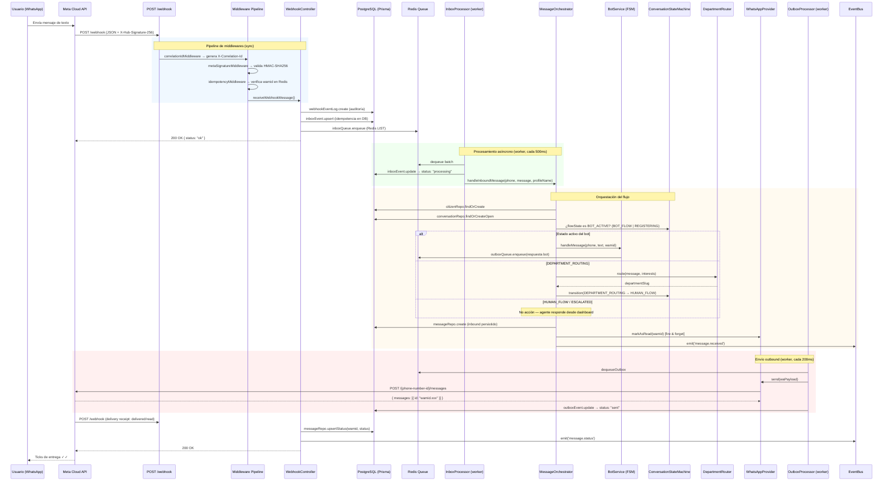

# Flujo Completo de Mensajería WhatsApp — Referencia Técnica

**Stack**: Node.js · TypeScript · Express · Prisma · PostgreSQL · Redis  
**API**: Meta WhatsApp Business Cloud API v20.0  
**Audiencia**: Desarrolladores backend con conocimiento intermedio de APIs REST y webhooks

---

## Tabla de Contenidos

1. [Introducción y Diagrama de Flujo](#1-introducción-y-diagrama-de-flujo)
2. [Fragmento 1 — Recepción y Verificación del Webhook](#2-fragmento-1--recepción-y-verificación-del-webhook)
3. [Fragmento 2 — Validación de Seguridad y Parseo del Payload](#3-fragmento-2--validación-de-seguridad-y-parseo-del-payload)
4. [Fragmento 3 — Enrutamiento del Mensaje: Orchestrator y FSM](#4-fragmento-3--enrutamiento-del-mensaje-orchestrator-y-fsm)
5. [Fragmento 4 — Generación y Envío de Respuestas](#5-fragmento-4--generación-y-envío-de-respuestas)
6. [Fragmento 5 — Detección y Ejecución de Transferencia a Humano](#6-fragmento-5--detección-y-ejecución-de-transferencia-a-humano)
7. [Apéndice A — Payload JSON de Ejemplo](#7-apéndice-a--payload-json-de-ejemplo)
8. [Apéndice B — Mapa de Archivos del Sistema](#8-apéndice-b--mapa-de-archivos-del-sistema)

---

## 1. Introducción y Diagrama de Flujo

### 1.1 Propósito del Webhook de WhatsApp

La **Meta WhatsApp Business Cloud API** utiliza un modelo basado en webhooks: Meta empuja (HTTP POST) cada evento —mensaje entrante, actualización de estado de entrega, error— hacia un endpoint HTTPS propiedad del desarrollador. El servidor debe:

1. Responder `200 OK` en **menos de 5 segundos** o Meta reintentará el envío.
2. Validar que la petición proviene de Meta mediante firma HMAC-SHA256.
3. Procesar el evento de forma **asíncrona** (después de responder 200).

Este backend adopta el patrón **inbox/outbox con colas Redis** para desacoplar la recepción del procesamiento, garantizando tanto la velocidad de respuesta a Meta como la resiliencia ante picos de carga.

---

### 1.2 Diagrama de Flujo — Ciclo de Vida Completo



---

## 2. Fragmento 1 — Recepción y Verificación del Webhook

**Archivo**: `src/routes/webhook.routes.ts` · `src/controllers/webhook.controller.ts`

### 2.1 Verificación del Webhook (GET)

Antes de que Meta comience a enviar eventos, requiere verificar que el endpoint es legítimo. Envía una petición `GET /webhook` con tres query parameters:

| Parámetro          | Tipo   | Descripción                                                                    |
| ------------------ | ------ | ------------------------------------------------------------------------------ |
| `hub.mode`         | string | Siempre `"subscribe"` en la solicitud de verificación.                         |
| `hub.verify_token` | string | Token secreto que configuraste en el panel de Meta.                            |
| `hub.challenge`    | string | Número aleatorio que debés retornar tal cual para probar control del endpoint. |

```typescript
// src/controllers/webhook.controller.ts
verifyWebhookChallenge = (req: Request, res: Response): void => {
  const mode = req.query['hub.mode'] as string | undefined;
  const token = req.query['hub.verify_token'] as string | undefined;
  const challenge = req.query['hub.challenge'] as string | undefined;

  // Validación estricta: modo + token deben coincidir exactamente
  if (mode === 'subscribe' && token === this.verifyToken) {
    console.log('[WebhookController] Verificación de webhook exitosa');
    res.status(200).send(challenge); // Devolver el challenge, no un JSON
    return;
  }

  console.warn('[WebhookController] Verificación fallida — token inválido o modo incorrecto');
  res.status(403).send('Forbidden');
};
```

> **Seguridad**: `this.verifyToken` se inyecta desde `env.WHATSAPP_VERIFY_TOKEN` (variable de entorno), nunca hardcodeado. La comparación directa `token === this.verifyToken` es segura aquí porque el valor es secreto y el tiempo de comparación de strings en este contexto no representa un vector de ataque práctico (a diferencia del HMAC del App Secret).

---

### 2.2 Recepción de Eventos (POST) y Pipeline de Middlewares

```typescript
// src/routes/webhook.routes.ts
router.post(
  '/',
  correlationIdMiddleware, // 1. Genera X-Correlation-Id (UUID v4)
  metaSignatureMiddleware, // 2. Valida HMAC-SHA256
  idempotencyMiddleware, // 3. Replay protection por wamid
  controller.receiveWebhookMessage, // 4. Persiste + encola + responde
);
```

**Pipeline de 4 capas** antes de que el payload llegue al controller:

1. **`correlationIdMiddleware`**: genera un UUID único por request, disponible en `res.locals.correlationId`. Se propaga en logs para trazabilidad end-to-end.

2. **`metaSignatureMiddleware`**: valida la firma HMAC-SHA256 del body crudo (ver Fragmento 2).

3. **`idempotencyMiddleware`**: extrae todos los `wamid` del payload y verifica en Redis si ya fueron procesados. Si todos existen → responde `200 { status: "already_processed" }` sin pasar al controller.

4. **`WebhookController.receiveWebhookMessage`**: procesa el payload.

**Headers HTTP relevantes del POST:**

| Header                | Obligatorio  | Descripción                                           |
| --------------------- | ------------ | ----------------------------------------------------- |
| `Content-Type`        | Sí           | `application/json`                                    |
| `X-Hub-Signature-256` | Sí           | `sha256=<HMAC hex>` del body crudo con el App Secret. |
| `X-Correlation-Id`    | No (interno) | Generado por el middleware, no viene de Meta.         |

---

### 2.3 El Controller: respuesta inmediata a Meta

```typescript
// src/controllers/webhook.controller.ts
receiveWebhookMessage = (req: Request, res: Response): void => {
  const correlationId = res.locals.correlationId ?? 'unknown';
  const payload = req.body as WaWebhookPayload | undefined;

  if (!payload || typeof payload !== 'object') {
    res.status(400).json({ error: 'Invalid payload' });
    return;
  }

  if (!this.webhookParser.isWhatsAppPayload(payload)) {
    // Payload válido pero no es WhatsApp (ej. Instagram): ignorar con 200
    res.status(200).json({ status: 'ignored' });
    return;
  }

  // ► Clave: processAsync NO bloquea la respuesta
  this.processAsync(payload, correlationId, req.ip).catch((err: unknown) => {
    console.error('[WebhookController] Error en processAsync:', err);
  });

  // Meta requiere 200 OK en < 5 segundos — respuesta inmediata
  res.status(200).json({ status: 'ok' });
};
```

> **Patrón Fire-and-Forget controlado**: `processAsync` es una Promise lanzada sin `await`, pero con `.catch()` para evitar unhandled rejections. La respuesta `200 OK` se envía **antes** de que finalice el procesamiento.

---

## 3. Fragmento 2 — Validación de Seguridad y Parseo del Payload

**Archivos**: `src/middlewares/metaSignature.middleware.ts` · `src/services/whatsapp/webhook-parser.service.ts` · `src/utils/wa-message-parser.ts` · `src/types/whatsapp.types.ts`

### 3.1 Validación de Firma HMAC-SHA256

```typescript
// src/middlewares/metaSignature.middleware.ts
export function metaSignatureMiddleware(
  req: RequestWithRawBody,
  res: Response,
  next: NextFunction,
): void {
  // ── 1. El rawBody debe estar disponible (capturado en server.ts) ──────────
  if (!req.rawBody) {
    res.status(400).json({ error: 'Raw body not available' });
    return;
  }

  // ── 2. Leer el header de firma de Meta ────────────────────────────────────
  const signature = req.headers['x-hub-signature-256'] as string | undefined;
  if (!signature) {
    res.status(401).json({ error: 'Missing X-Hub-Signature-256 header' });
    return;
  }

  // ── 3. Calcular la firma esperada con el App Secret ───────────────────────
  const expectedSignature =
    'sha256=' +
    crypto.createHmac('sha256', env.WHATSAPP_APP_SECRET).update(req.rawBody).digest('hex');

  // ── 4. Comparación timing-safe (previene timing attacks) ─────────────────
  const sigBuffer = Buffer.from(signature);
  const expectedBuffer = Buffer.from(expectedSignature);

  if (
    sigBuffer.length !== expectedBuffer.length ||
    !crypto.timingSafeEqual(sigBuffer, expectedBuffer)
  ) {
    res.status(401).json({ error: 'Invalid X-Hub-Signature-256' });
    return;
  }

  next(); // ✓ Firma válida
}
```

**Aspectos de seguridad críticos:**

- **`req.rawBody`**: La firma se calcula sobre el cuerpo HTTP **crudo** (bytes tal como llegaron), no sobre el JSON parseado. Express debe capturarlo en `server.ts` antes del parseo: `express.json({ verify: (req, _res, buf) => { req.rawBody = buf; } })`. Si se usara `JSON.stringify(req.body)`, cualquier reordenamiento de claves rompería la validación.
- **`crypto.timingSafeEqual`**: Imprescindible. Una comparación `===` normal filtra información sobre cuántos caracteres coinciden según el tiempo que tarda, permitiendo ataques de timing. `timingSafeEqual` siempre toma el mismo tiempo independientemente de cuánto coincidan los buffers.
- **`Buffer.length` check previo**: `timingSafeEqual` lanza excepción si los buffers no tienen el mismo tamaño. Se verifica explícitamente para evitar el crash y retornar `401` correctamente.

---

### 3.2 Estructura del Payload Entrante (JSON desglosado)

Ejemplo completo de un mensaje de texto simple:

```json
{
  "object": "whatsapp_business_account",
  "entry": [
    {
      "id": "123456789012345",
      "changes": [
        {
          "field": "messages",
          "value": {
            "messaging_product": "whatsapp",
            "metadata": {
              "display_phone_number": "5491100000000",
              "phone_number_id": "987654321098765"
            },
            "contacts": [
              {
                "wa_id": "5491155556666",
                "profile": { "name": "Juan Pérez" }
              }
            ],
            "messages": [
              {
                "type": "text",
                "id": "wamid.HBgLNTQ5MTE1NTU1NjY2FQIAEhggRDRBQkI0MkFGRThCNEYxOEZFMzA3NDRGODM5OUQZAA==",
                "from": "5491155556666",
                "timestamp": "1714150000",
                "text": { "body": "Hola, necesito información" }
              }
            ]
          }
        }
      ]
    }
  ]
}
```

**Desglose de campos clave:**

| Campo                     | Path                                                  | Descripción                                                                                                                                                    |
| ------------------------- | ----------------------------------------------------- | -------------------------------------------------------------------------------------------------------------------------------------------------------------- |
| `object`                  | `.object`                                             | Siempre `"whatsapp_business_account"` para WhatsApp. Permite distinguir de otros productos de Meta (Instagram, Messenger).                                     |
| `entry[].id`              | `.entry[0].id`                                        | ID de la cuenta de WhatsApp Business (WABA ID). Útil en multi-tenant.                                                                                          |
| `changes[].field`         | `.entry[0].changes[0].field`                          | Tipo de evento. `"messages"` para mensajes y delivery receipts.                                                                                                |
| `phone_number_id`         | `.entry[0].changes[0].value.metadata.phone_number_id` | ID del número de teléfono de tu negocio en Meta. Se usa como identificador para enviar respuestas.                                                             |
| `contacts[].wa_id`        | `.entry[0].changes[0].value.contacts[0].wa_id`        | Número del remitente en formato E.164 sin `+`.                                                                                                                 |
| `contacts[].profile.name` | `.entry[0].changes[0].value.contacts[0].profile.name` | Nombre de perfil de WhatsApp del remitente (puede estar vacío).                                                                                                |
| `messages[].id`           | `.entry[0].changes[0].value.messages[0].id`           | **WAMID** — ID único del mensaje en Meta. Se usa para deduplicación, `markAsRead`, y correlación de delivery receipts.                                         |
| `messages[].from`         | `.entry[0].changes[0].value.messages[0].from`         | Número del remitente (igual a `wa_id`).                                                                                                                        |
| `messages[].timestamp`    | `.entry[0].changes[0].value.messages[0].timestamp`    | Unix timestamp (segundos) de cuándo el usuario envió el mensaje.                                                                                               |
| `messages[].type`         | `.entry[0].changes[0].value.messages[0].type`         | Discriminante del tipo de mensaje: `text`, `image`, `audio`, `video`, `document`, `location`, `interactive`, `reaction`, `sticker`, `contacts`, `unsupported`. |
| `messages[].text.body`    | `.entry[0].changes[0].value.messages[0].text.body`    | Contenido textual (solo presente cuando `type === "text"`).                                                                                                    |

---

### 3.3 Tipos TypeScript del Payload

El sistema usa una **discriminated union** para `WaInboundMessage`, garantizando type-safety en el manejo de cada tipo de mensaje:

```typescript
// src/types/whatsapp.types.ts
export type WaInboundMessage =
  | { type: 'text'; id: string; from: string; timestamp: string; text: WaTextContent }
  | { type: 'image'; id: string; from: string; timestamp: string; image: WaMediaContent }
  | { type: 'audio'; id: string; from: string; timestamp: string; audio: WaMediaContent }
  | { type: 'video'; id: string; from: string; timestamp: string; video: WaMediaContent }
  | { type: 'document'; id: string; from: string; timestamp: string; document: WaMediaContent }
  | { type: 'location'; id: string; from: string; timestamp: string; location: WaLocationContent }
  | {
      type: 'interactive';
      id: string;
      from: string;
      timestamp: string;
      interactive: WaInteractiveReply;
    }
  | { type: 'reaction'; id: string; from: string; timestamp: string; reaction: WaReactionContent }
  | { type: 'unsupported'; id: string; from: string; timestamp: string };

export interface WaWebhookPayload {
  object: string;
  entry: WaWebhookEntry[]; // WaWebhookEntry → WaWebhookChange → WaWebhookValue → messages[]
}
```

---

### 3.4 Parseo y Extracción de Datos Clave

`WebhookParserService` valida la estructura con **Zod** y delega el parseo profundo a `parseWebhookPayload`:

```typescript
// src/services/whatsapp/webhook-parser.service.ts

// Validación estructural mínima con Zod
const webhookPayloadSchema = z.object({
  object: z.string(),
  entry: z.array(
    z.object({
      id: z.string(),
      changes: z.array(
        z.object({
          field: z.string(),
          value: z.record(z.string(), z.unknown()),
        }),
      ),
    }),
  ),
});

export class WebhookParserService {
  parse(payload: WaWebhookPayload): ParsedWebhookResult {
    return parseWebhookPayload(payload); // src/utils/wa-message-parser.ts
  }

  isWhatsAppPayload(payload: WaWebhookPayload | null | undefined): boolean {
    return payload?.object === 'whatsapp_business_account';
  }
}
```

`ParsedWebhookResult` contiene dos colecciones separadas:

```typescript
interface ParsedWebhookResult {
  messages: ParsedWebhookMessage[]; // mensajes inbound listos para procesar
  statuses: ParsedWaStatus[]; // delivery receipts (sent/delivered/read/failed)
}

interface ParsedWebhookMessage {
  wamid: string; // ID único del mensaje (para deduplicación)
  phone: string; // número del remitente (E.164 normalizado)
  profileName?: string; // nombre de perfil del contacto
  message: WaInboundMessage; // discriminated union tipada
}
```

---

## 4. Fragmento 3 — Enrutamiento del Mensaje: Orchestrator y FSM

**Archivos**: `src/services/orchestrator/message-orchestrator.service.ts` · `src/services/orchestrator/conversation-state-machine.ts` · `src/services/bot.service.ts` · `src/config/conversation-states.ts`

### 4.1 La Máquina de Estados de Conversación (Macro-FSM)

El sistema usa **dos niveles de FSM** anidadas:

- **Macro-FSM** (`ConversationStateMachine`): estado de la _conversación_ en la base de datos, visible desde el dashboard del agente.
- **Micro-FSM** (`BotService`): estado interno del _proceso de registro_ del ciudadano, almacenado en Redis.

**Estados de la Macro-FSM y transiciones válidas:**

```
BOT_FLOW ──────────────► REGISTERING ──────────────► DEPARTMENT_ROUTING
    │                         │                              │
    │                         │                              ▼
    │                         └──────────────────────► HUMAN_FLOW ◄──────┐
    │                                                        │            │
    └───────────────────────────────────────────────────► ESCALATED       │
                                                            │             │
                                                            └─────────────┘
                                                        Todos → CLOSED
                                                        CLOSED → BOT_FLOW (re-apertura)
```

```typescript
// src/config/conversation-states.ts
export const VALID_TRANSITIONS: Record<ConversationFlowState, ConversationFlowState[]> = {
  BOT_FLOW: ['REGISTERING', 'DEPARTMENT_ROUTING', 'HUMAN_FLOW', 'ESCALATED', 'CLOSED'],
  REGISTERING: ['BOT_FLOW', 'DEPARTMENT_ROUTING', 'CLOSED'],
  DEPARTMENT_ROUTING: ['HUMAN_FLOW', 'BOT_FLOW', 'ESCALATED', 'CLOSED'],
  HUMAN_FLOW: ['BOT_FLOW', 'ESCALATED', 'CLOSED'],
  ESCALATED: ['HUMAN_FLOW', 'CLOSED'],
  CLOSED: ['BOT_FLOW'],
};

/** El bot sólo actúa en estos estados */
export const BOT_ACTIVE_STATES: ConversationFlowState[] = ['BOT_FLOW', 'REGISTERING'];

/** Estos estados requieren agente humano */
export const HUMAN_ACTIVE_STATES: ConversationFlowState[] = ['HUMAN_FLOW', 'ESCALATED'];
```

**Punto de entrada del Orchestrator:**

```typescript
// src/services/orchestrator/message-orchestrator.service.ts
async handleInboundMessage(
  phone: string,
  message: WaInboundMessage,
  profileName?: string,
): Promise<void> {
  // 1. Ciudadano: find or create por número de teléfono
  const citizen = await this.citizenRepo.findOrCreate(phone, profileName);

  // 2. Conversación: la más reciente abierta, o crear una nueva
  const conversation = await this.conversationRepo.findOrCreateOpen(citizen.id);
  const ctx = await this.conversationRepo.getConversationContext(conversation.id);

  const flowState = ctx.meta.flowState as ConversationFlowState;

  // 3. Decisión de routing según el estado actual de la conversación
  if (BOT_ACTIVE_STATES.includes(flowState)) {
    await this.handleBotFlow(phone, message, conversation.id, citizen.id, flowState, version);
  } else if (flowState === 'DEPARTMENT_ROUTING') {
    await this.handleDepartmentRouting(message, conversation.id, citizen.id, version, citizen.interests);
  }
  // HUMAN_FLOW / ESCALATED → no hay acción del sistema; el agente responde desde el dashboard

  // 4. Persistir el mensaje inbound en PostgreSQL
  await this.messageRepo.create({ conversationId: conversation.id, body: text, direction: 'inbound', ... });

  // 5. Marcar como leído en WhatsApp (fire & forget — no bloquea)
  this.whatsappProvider.markAsRead(message.id).catch(...);

  // 6. Emitir evento interno para WebSocket/listeners del dashboard
  eventBus.emit('message.received', { wamid: message.id, phone, conversationId, ... });
}
```

---

### 4.2 Micro-FSM del Bot de Registro (`BotService`)

El bot guía al ciudadano a través de un proceso de registro secuencial:

```
NAME → NEIGHBORHOOD → INTERESTS → AWAITING_INTERESTS → COMPLETED
```

| Estado FSM           | Qué espera el bot             | Qué persiste                           |
| -------------------- | ----------------------------- | -------------------------------------- |
| `NAME`               | Nombre completo del ciudadano | `session.name` en Redis                |
| `NEIGHBORHOOD`       | Texto libre → fuzzy match     | `session.neighborhoodId` en Redis + DB |
| `INTERESTS`          | Número de lista o texto       | Navegación por colonias                |
| `AWAITING_INTERESTS` | Números separados por coma    | `session.interests[]` en Redis         |
| `COMPLETED`          | — (registro finalizado)       | Ciudadano registrado en DB             |

**Sesión de Redis:**

```typescript
// src/services/bot.service.ts
export interface BotSession {
  state: BotFsmState; // estado actual de la micro-FSM
  name?: string; // nombre capturado
  lastName?: string; // apellido si aplica
  neighborhoodId?: string; // UUID de la colonia seleccionada
  interests?: string[]; // slugs de intereses seleccionados
  lastProcessedWamid?: string; // último wamid procesado (dedup por mensaje)
  pendingNeighborhoodConfirmation?: {
    id: string;
    name: string;
    score: number;
  }; // fuzzy match pendiente de confirmación
}

// Clave Redis: bot:session:{phone} — TTL: 24 horas
const sessionKey = (phone: string): string => `bot:session:${phone}`;
```

**Cómo se decide qué hacer con el mensaje:**

1. Se carga la sesión desde Redis (`bot:session:{phone}`). Si no existe, el usuario es nuevo → estado inicial `NAME`.
2. Se aplica `switch(session.state)` para despachar al handler correcto.
3. El handler valida la entrada, actualiza la sesión en Redis, persiste en DB si corresponde, y encola la respuesta en el OutboxProcessor.
4. Si el estado llega a `COMPLETED`, el Orchestrator transiciona la macro-FSM a `DEPARTMENT_ROUTING`.

---

### 4.3 Enrutamiento a Departamento (`DepartmentRouterStrategy`)

Cuando la conversación entra en `DEPARTMENT_ROUTING`, el sistema aplica el **Strategy Pattern** con tres estrategias en orden de prioridad:

```typescript
// src/services/orchestrator/department-router.strategy.ts

// Estrategia 1: Keywords en el texto del mensaje
class KeywordRoutingStrategy implements DepartmentRoutingStrategy {
  async route(ctx: RoutingContext): Promise<string | undefined> {
    const text = extractMessageText(ctx.message)?.toLowerCase();
    // Busca en la tabla Department por coincidencia en el array `keywords`
    // Retorna el primer slug que coincide
  }
}

// Estrategia 2: Intereses registrados del ciudadano
class InterestRoutingStrategy implements DepartmentRoutingStrategy {
  async route(ctx: RoutingContext): Promise<string | undefined> {
    // Busca en Department cuyo slug coincida con los intereses del ciudadano
  }
}

// Estrategia 3: Fallback al departamento general
class FallbackRoutingStrategy implements DepartmentRoutingStrategy {
  async route(_ctx: RoutingContext): Promise<string | undefined> {
    // Retorna el slug del departamento con isDefault: true
  }
}
```

El router `DepartmentRouterStrategy` itera las estrategias en orden y usa la primera que retorna un valor:

```
KeywordStrategy → InterestStrategy → FallbackStrategy
```

Si se encuentra un departamento, el Orchestrator llama a `stateMachine.transition(conversationId, 'HUMAN_FLOW', ...)`.

---

## 5. Fragmento 4 — Generación y Envío de Respuestas

**Archivos**: `src/services/whatsapp/whatsapp.provider.ts` · `src/services/events/outbox-processor.service.ts` · `src/config/meta.config.ts`

### 5.1 Construcción del Payload de Respuesta

Todo mensaje outbound implementa `WaOutboundBase`:

```typescript
// Mensaje de texto simple
const textPayload: WaTextOutbound = {
  messaging_product: 'whatsapp',
  recipient_type: 'individual',
  to: '5491155556666', // número destino en E.164 sin '+'
  type: 'text',
  text: {
    body: '¡Hola! Por favor, escribí tu nombre completo.',
    preview_url: false,
  },
};

// Mensaje interactivo con botones (hasta 3 botones)
const interactivePayload: WaInteractiveOutbound = {
  messaging_product: 'whatsapp',
  recipient_type: 'individual',
  to: '5491155556666',
  type: 'interactive',
  interactive: {
    type: 'button',
    body: { text: '¿Cuál es tu tema de interés principal?' },
    action: {
      buttons: [
        { type: 'reply', reply: { id: 'seguridad_publica', title: 'Seguridad' } },
        { type: 'reply', reply: { id: 'salud_bienestar', title: 'Salud' } },
        { type: 'reply', reply: { id: 'obras_pavimentacion', title: 'Obras' } },
      ],
    },
  },
};

// Mensaje de lista (hasta 10 secciones, usado para menú de colonias)
const listPayload: WaInteractiveOutbound = {
  messaging_product: 'whatsapp',
  recipient_type: 'individual',
  to: '5491155556666',
  type: 'interactive',
  interactive: {
    type: 'list',
    body: { text: 'Seleccioná tu colonia:' },
    action: {
      button: 'Ver colonias',
      sections: [
        {
          title: 'Colonias disponibles',
          rows: [
            { id: 'uuid-colonia-1', title: 'Col. Centro', description: 'Zona centro' },
            { id: 'uuid-colonia-2', title: 'Col. San Marcos', description: 'Zona norte' },
          ],
        },
      ],
    },
  },
};
```

---

### 5.2 La Llamada HTTP a la API de Meta (`WhatsAppProvider`)

```typescript
// src/services/whatsapp/whatsapp.provider.ts
export class WhatsAppProvider {
  private readonly baseUrl = metaConfig.messagesUrl;
  // URL: https://graph.facebook.com/v20.0/{phone-number-id}/messages

  private readonly headers = {
    Authorization: `Bearer ${metaConfig.accessToken}`,
    'Content-Type': 'application/json',
  };

  // App Secret Proof: HMAC-SHA256(accessToken, appSecret) — requerido por Meta
  // para apps con App Secret Proof habilitado en el panel de Facebook.
  private readonly appSecretProof = generateAppSecretProof(
    metaConfig.accessToken,
    metaConfig.appSecret,
  );

  async send(payload: WaOutboundMessage): Promise<WaSendMessageResponse> {
    return this.post(payload);
  }

  private async post(payload: WaOutboundMessage | WaReadReceipt): Promise<WaSendMessageResponse> {
    // App Secret Proof se agrega como query parameter
    const url = `${this.baseUrl}?appsecret_proof=${this.appSecretProof}`;

    // Timeout de 10 segundos para detectar cuellos de botella en Meta API
    const controller = new AbortController();
    const timeout = setTimeout(() => controller.abort(), metaConfig.httpTimeoutMs);

    try {
      const response = await fetch(url, {
        method: 'POST',
        headers: this.headers,
        body: JSON.stringify(payload),
        signal: controller.signal,
      });

      const body: unknown = await response.json();

      if (!response.ok) {
        // Meta retorna { error: { code, message, ... } } en respuestas 4xx/5xx
        if (isMetaErrorResponse(body)) {
          const metaError = parseMetaError(body);
          // Si el error es "outside 24h conversation window" → usar template
          if (isOutsideConversationWindow(metaError)) {
            // Fallback automático a template message (ej. re-engagement)
          }
          throw metaError;
        }
        throw new Error(`Meta API error: ${response.status}`);
      }

      return body as WaSendMessageResponse;
      // Respuesta exitosa: { messaging_product: "whatsapp", contacts: [...], messages: [{ id: "wamid.xxx" }] }
    } finally {
      clearTimeout(timeout);
    }
  }
}
```

**Headers de la llamada saliente a Meta:**

| Header                   | Valor                                       |
| ------------------------ | ------------------------------------------- |
| `Authorization`          | `Bearer {WHATSAPP_ACCESS_TOKEN}`            |
| `Content-Type`           | `application/json`                          |
| Query: `appsecret_proof` | `HMAC-SHA256(accessToken, appSecret)` (hex) |

---

### 5.3 El OutboxProcessor: fiabilidad de envío

Para garantizar entrega y reintentos, los mensajes outbound pasan por un **OutboxProcessor** antes de llegar a `WhatsAppProvider`:

```typescript
// src/services/events/outbox-processor.service.ts

// Paso 1: el BotService (u otros) encolan el mensaje
async enqueue(phone: string, waPayload: WaOutboundMessage, idempotencyKey: string): Promise<void> {
  // Idempotencia: si ya existe este outboxEvent, no duplicar
  const existing = await this.prisma.outboxEvent.findUnique({ where: { idempotencyKey } });
  if (existing) return;

  // Persistir en PostgreSQL ANTES de encolar en Redis
  // Si Redis falla, el evento queda en DB para recovery manual
  const outboxEvent = await this.prisma.outboxEvent.create({
    data: { phone, payload: waPayload, idempotencyKey, status: 'pending' },
  });

  // Encolar en Redis LIST (queue FIFO)
  await this.queue.enqueueOutbox({ id: randomUUID(), payload: { outboxEventId: outboxEvent.id, phone, waPayload }, ... });
}

// Paso 2: worker poll cada 200ms
private async processItem(item): Promise<void> {
  const { outboxEventId, waPayload } = item.payload;
  await this.prisma.outboxEvent.update({ where: { id: outboxEventId }, data: { status: 'sending' } });
  const response = await this.whatsappProvider.send(waPayload);
  await this.prisma.outboxEvent.update({
    where: { id: outboxEventId },
    data: { status: 'sent', externalMessageId: response.messages[0].id },
  });
}
```

**Ciclo de vida de un OutboxEvent:**

```
pending → sending → sent
                  ↘ failed → (retry con backoff exponencial via queue.promoteRetryItems)
```

---

### 5.4 Rate Limiting Outbound

`WhatsAppProvider` implementa rate limiting por número destino usando Redis:

```typescript
private async checkRateLimit(phone: string): Promise<void> {
  const key   = REDIS_KEYS.RATE_LIMIT_OUTBOUND(phone); // rate:out:{phone}
  const count = await this.redis.incr(key, 1);         // INCR con TTL de 1 segundo
  if (count > QUEUE_CONFIG.OUTBOUND_RATE_PER_SECOND) {
    throw new Error(`Rate limit exceeded for phone ${phone}`);
  }
}
```

Esto evita exceder los límites de Meta (actualmente 80 mensajes/segundo por número de teléfono en tier básico).

---

## 6. Fragmento 5 — Detección y Ejecución de Transferencia a Humano

**Archivos**: `src/services/orchestrator/message-orchestrator.service.ts` · `src/services/orchestrator/conversation-state-machine.ts` · `src/controllers/handover.controller.ts` · `src/services/events/event-bus.service.ts`

### 6.1 Gatillo de Transferencia Automática (Bot → Humano)

El handover automático ocurre cuando el `BotService` completa el registro y la macro-FSM necesita transicionar:

```typescript
// src/services/orchestrator/message-orchestrator.service.ts — handleBotFlow()
await this.botService.handleMessage(phone, text, message.id, this.correlationId);

// Verificar si el bot terminó el flujo de registro
const session = await this.botService.getSession(phone);
if (session.state === BotFsmState.COMPLETED && currentFlowState === 'REGISTERING') {
  // Transicionar la conversación a DEPARTMENT_ROUTING
  await this.stateMachine.transition(conversationId, 'DEPARTMENT_ROUTING', currentVersion, {
    triggeredBy: 'bot',
  });

  // Emitir evento para que el dashboard actualice en tiempo real
  eventBus.emit('conversation.handover', {
    conversationId,
    fromState: 'REGISTERING',
    toState: 'DEPARTMENT_ROUTING',
    triggeredBy: 'bot',
    correlationId: this.correlationId,
  });
}
```

---

### 6.2 La Máquina de Estados Ejecuta la Transición con Optimistic Locking

```typescript
// src/services/orchestrator/conversation-state-machine.ts
async transition(
  conversationId: string,
  toState: ConversationFlowState,
  currentVersion: number,
  opts?: { triggeredBy?: 'bot' | 'user' | 'agent' | 'system'; agentId?: string; departmentSlug?: string }
): Promise<void> {
  const ctx = await this.conversationRepo.getConversationContext(conversationId);
  const fromState = ctx.meta.flowState as ConversationFlowState;

  // 1. Validar que la transición está permitida en el grafo
  if (!this.isValidTransition(fromState, toState)) {
    throw new Error(`Transición inválida: ${fromState} → ${toState}`);
  }

  // 2. Evitar transiciones idempotentes (anti-loop)
  if (fromState === toState) {
    console.warn(`[StateMachine] Transición ${fromState} → ${toState} idempotente, ignorando`);
    return;
  }

  // 3. Aplicar en DB con optimistic locking (version field evita race conditions)
  await this.conversationRepo.updateFlowState(
    conversationId,
    toState,
    currentVersion,         // si la versión en DB no coincide, Prisma lanza error
    { lockedByUserId: opts?.agentId, departmentSlug: opts?.departmentSlug }
  );

  // 4. Emitir evento de handover si aplica (BOT → HUMAN o viceversa)
  if (['BOT_FLOW', 'REGISTERING'].includes(fromState) &&
      ['HUMAN_FLOW', 'ESCALATED'].includes(toState)) {
    eventBus.emit('conversation.handover', {
      conversationId, fromState, toState,
      triggeredBy: opts?.triggeredBy ?? 'system',
      agentId: opts?.agentId,
    });
  }
}
```

> **Optimistic Locking**: El campo `version` en la tabla `ConversationMeta` actúa como guard concurrente. Si dos workers intentan transicionar la misma conversación simultáneamente, el segundo falla porque la versión ya fue incrementada por el primero. Esto previene estados inconsistentes sin locks de base de datos.

---

### 6.3 Notificación en Tiempo Real al Dashboard (EventBus)

El EventBus es un `EventEmitter` interno tipado. Cuando se emite `conversation.handover`, todos los listeners suscritos reciben el evento:

```typescript
// src/services/events/event-bus.service.ts
export type EventMap = {
  'message.received': MessageReceivedEvent;
  'message.status': MessageStatusEvent;
  'conversation.handover': ConversationHandoverEvent;
  'outbox.enqueued': OutboxEnqueuedEvent;
};

export class EventBusService extends EventEmitter {
  emit<K extends keyof EventMap>(event: K, payload: EventMap[K]): boolean {
    return super.emit(event, payload);
  }
  on<K extends keyof EventMap>(event: K, listener: (payload: EventMap[K]) => void): this {
    return super.on(event, listener);
  }
}

// Singleton exportado
export const eventBus = new EventBusService();
```

**Flujo de notificación al agente** (extensión sugerida):

```typescript
// Ejemplo: listener en un WebSocket gateway del dashboard
eventBus.on('conversation.handover', (payload: ConversationHandoverEvent) => {
  if (payload.toState === 'HUMAN_FLOW' || payload.toState === 'DEPARTMENT_ROUTING') {
    // Emitir via Socket.io al dashboard de agentes
    io.to(`dept:${payload.departmentSlug}`).emit('new_conversation', {
      conversationId: payload.conversationId,
      fromState: payload.fromState,
      toState: payload.toState,
    });
  }
});
```

---

### 6.4 Handover Manual: El Agente Toma el Control

Los agentes pueden tomar o liberar conversaciones manualmente desde el dashboard:

```typescript
// src/controllers/handover.controller.ts

// POST /api/v1/handover/take — el agente toma control
take = async (req: Request, res: Response): Promise<void> => {
  const { conversationId } = takeoverSchema.parse(req.body);
  const agent = req.user; // del JWT middleware

  const ctx = await this.conversationRepo.getConversationContext(conversationId);
  const currentState = ctx.meta.flowState as ConversationFlowState;

  // Validar que no está ya en manos de un agente
  if (currentState === 'HUMAN_FLOW' || currentState === 'ESCALATED') {
    res.status(409).json({ error: 'Conversación ya asignada a agente' });
    return;
  }

  // Transición con el agentId para bloquear la conversación
  await this.stateMachine.transition(conversationId, 'HUMAN_FLOW', ctx.meta.version, {
    triggeredBy: 'agent',
    agentId: agent.id,
  });

  res.status(200).json({ status: 'taken', conversationId });
};

// POST /api/v1/handover/release — el agente devuelve al bot
release = async (req: Request, res: Response): Promise<void> => {
  // Transición HUMAN_FLOW → BOT_FLOW
  await this.stateMachine.transition(conversationId, 'BOT_FLOW', ctx.meta.version, {
    triggeredBy: 'agent',
  });
  res.status(200).json({ status: 'released', conversationId });
};
```

---

### 6.5 Cómo el Sistema Sabe que Debe Rutear al Agente (No al Bot)

La distinción es completamente basada en el `flowState` de la conversación en DB:

```typescript
// src/services/orchestrator/message-orchestrator.service.ts
const flowState = ctx.meta.flowState as ConversationFlowState;

if (BOT_ACTIVE_STATES.includes(flowState)) {
  // BOT_FLOW | REGISTERING → delegar al BotService
  await this.handleBotFlow(...);

} else if (flowState === 'DEPARTMENT_ROUTING') {
  // Enrutar a departamento y transicionar a HUMAN_FLOW
  await this.handleDepartmentRouting(...);

} // else: HUMAN_FLOW | ESCALATED → el orchestrator NO actúa.
  // Los mensajes inbound se persisten y se emite message.received,
  // pero la lógica de respuesta la maneja el agente desde el dashboard
  // usando MessagesController → OutboxProcessorService.
```

**El bot "se detiene" simplemente porque el `flowState` deja de estar en `BOT_ACTIVE_STATES`**. No hay flag adicional ni desactivación explícita: la FSM de conversación ES la fuente de verdad.

---

## 7. Apéndice A — Payload JSON de Ejemplo

### 7.1 Payload completo de mensaje de texto

```json
{
  "object": "whatsapp_business_account",
  "entry": [
    {
      "id": "123456789012345",
      "changes": [
        {
          "field": "messages",
          "value": {
            "messaging_product": "whatsapp",
            "metadata": {
              "display_phone_number": "5491100000000",
              "phone_number_id": "987654321098765"
            },
            "contacts": [
              {
                "wa_id": "5491155556666",
                "profile": { "name": "Juan Pérez" }
              }
            ],
            "messages": [
              {
                "type": "text",
                "id": "wamid.HBgLNTQ5MTE1NTU1NjY2FQIAEhggRDRBQkI0MkFGRThCNEYxOEZFMzA3NDRGODM5OUQZAA==",
                "from": "5491155556666",
                "timestamp": "1714150000",
                "text": { "body": "Hola, necesito información" }
              }
            ]
          }
        }
      ]
    }
  ]
}
```

### 7.2 Payload de delivery receipt (read)

```json
{
  "object": "whatsapp_business_account",
  "entry": [
    {
      "id": "123456789012345",
      "changes": [
        {
          "field": "messages",
          "value": {
            "messaging_product": "whatsapp",
            "metadata": {
              "display_phone_number": "5491100000000",
              "phone_number_id": "987654321098765"
            },
            "statuses": [
              {
                "id": "wamid.HBgLNTQ5MTE1NTU1NjY2FQIAEhggRDRBQkI0MkFGRThCNEYxOEZFMzA3NDRGODM5OUQZAA==",
                "status": "read",
                "timestamp": "1714150005",
                "recipient_id": "5491155556666"
              }
            ]
          }
        }
      ]
    }
  ]
}
```

### 7.3 Payload de respuesta exitosa de Meta al enviar un mensaje

```json
{
  "messaging_product": "whatsapp",
  "contacts": [{ "input": "5491155556666", "wa_id": "5491155556666" }],
  "messages": [{ "id": "wamid.HBgLNTQ5MTE1NTU1NjY2FQIAERgSMzRBNTlGMzBDODg0NUYxREE4AA==" }]
}
```

---

## 8. Apéndice B — Mapa de Archivos del Sistema

| Archivo                                                     | Responsabilidad                                                                     |
| ----------------------------------------------------------- | ----------------------------------------------------------------------------------- |
| `src/routes/webhook.routes.ts`                              | Registro del pipeline GET + POST `/webhook` con los 4 middlewares                   |
| `src/controllers/webhook.controller.ts`                     | Adapter HTTP: verifica challenge, parsea, persiste InboxEvent, encola, responde 200 |
| `src/controllers/handover.controller.ts`                    | Adapter HTTP: endpoints `/take` y `/release` para gestión manual de agentes         |
| `src/controllers/messages.controller.ts`                    | Adapter HTTP: `POST /messages/text` para mensajes outbound desde el dashboard       |
| `src/middlewares/metaSignature.middleware.ts`               | Validación HMAC-SHA256 del header `X-Hub-Signature-256`                             |
| `src/middlewares/idempotency.middleware.ts`                 | Replay protection vía Redis — deduplica por wamid (TTL 24h)                         |
| `src/middlewares/correlationId.middleware.ts`               | Genera y adjunta UUID de correlación por request                                    |
| `src/services/whatsapp/webhook-parser.service.ts`           | Validación Zod y parseo del payload a `ParsedWebhookResult`                         |
| `src/services/events/inbox-processor.service.ts`            | Worker que consume la queue inbound Redis (poll 500ms)                              |
| `src/services/events/outbox-processor.service.ts`           | Worker que consume la queue outbound Redis y llama a WhatsAppProvider (poll 200ms)  |
| `src/services/events/event-bus.service.ts`                  | EventEmitter tipado para comunicación interna (dashboard real-time)                 |
| `src/services/orchestrator/message-orchestrator.service.ts` | Orquesta el flujo: ciudadano → conversación → bot/agente → persistencia → evento    |
| `src/services/orchestrator/conversation-state-machine.ts`   | Macro-FSM: transiciones validadas con optimistic locking                            |
| `src/services/orchestrator/department-router.strategy.ts`   | Strategy Pattern: Keyword → Interest → Fallback para asignar departamento           |
| `src/services/bot.service.ts`                               | Micro-FSM del bot: NAME → NEIGHBORHOOD → INTERESTS → COMPLETED (sesión en Redis)    |
| `src/services/whatsapp/whatsapp.provider.ts`                | Cliente HTTP para Meta Cloud API: send, markAsRead, rate limiting, App Secret Proof |
| `src/config/conversation-states.ts`                         | Grafo de transiciones válidas y clasificación de estados activos                    |
| `src/config/meta.config.ts`                                 | URLs, tokens y timeouts de Meta API                                                 |
| `src/types/whatsapp.types.ts`                               | Tipos TypeScript completos: discriminated union para inbound, tipos outbound        |

---

_Documento generado el 26/04/2026. Refleja el estado actual del codebase en `backend/src/`._
